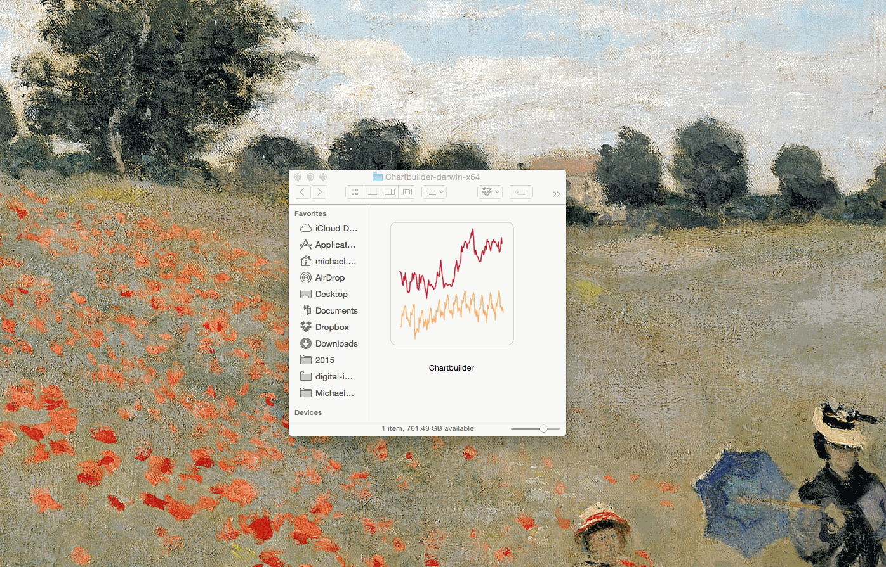

Chartbuilder Electron
======================

> A desktop version of Quartz's [Chartbuilder app](https://github.com/quartz/chartbuilder).

## Download

Download the latest on the [Releases](https://github.com/mhkeller/chartbuilder-electron/releases) page. If you're on OS X, select the `Darwin` release. Because Chartbuilder isn't on npm, it's currently pegged to the [latest commit](package.json#L31) so we can keep track of what version this was built with.

## Why

In thinking about newsroom adoption, sometimes simply having something in the dock is so much easier than navigating to a (possibly ugly internal) URL. The dock is the new bookmark.



## Things to do

See the [issue tracker](https://github.com/mhkeller/chartbuilder-electron/issues) for more detail. Help welcome!

* Set up auto-updating with [electron-gh-releases](https://github.com/jenslind/electron-gh-releases) and command-line releases with [publish-release](https://github.com/remixz/publish-release).
* Figure out a way to inject the necessary menu JavaScript into the Chartbuilder JS environment per [docs](https://github.com/atom/electron/blob/master/docs/api/menu.md) without altering that repo.
* Set default download location to something other than `~/Library/Application Support/Chartbuilder/Downloads/`.

## Using your customized Chartbuilder build

If your build is on GitHub and the install and build processes haven't deviated from Chartbuilder 2.0, then fork this repository and replace the dependency information in `package.json` [near line 31](package.json#L31) with your own info. 

For example, if my fork of Chartbuilder lives at `http://github.com/mhkeller/Chartbuilder`, the `package.json` line would look like:

````json
  "dependencies": {
    "chartbuilder": "mhkeller/Chartbuilder",
    "electron-debug": "^0.1.1"
  },
````

Then, follow the **Developing** instructions below to create your build.

*Note on versioning:* For the `chartbuilder-electron` repo, there's added [a commit sha preceeded](package.json#L31) by a `#` to better keep track of which version of that repository we are pulling, but that is optional. Without a specific commit or branch name, it will pull the latest at the time of building. 

For more information on npm dependencies as Git Urls, [check out the npm docs](https://docs.npmjs.com/files/package.json#git-urls-as-dependencies).

## Developing

### To install everything

````shell
npm run init
````

### To run the app locally

````shell
npm start
````

### To build out the binaries

````shell
npm run build
````

Builds the app for OS X, Linux, and Windows, using [electron-packager](https://github.com/maxogden/electron-packager).


## License

MIT © [mhkeller](http://github.com/mhkeller)
